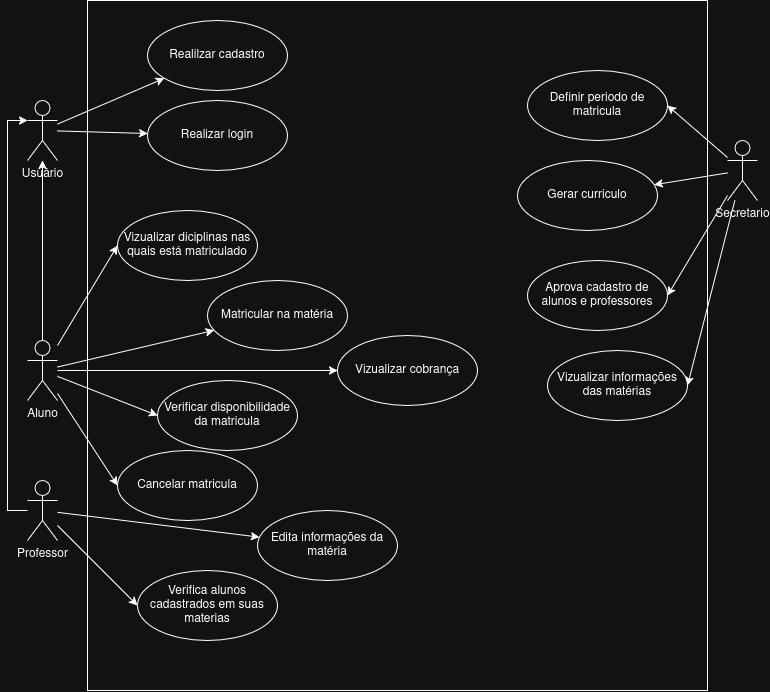

# Sistema-de-Matriculas

### Diagrama de casos de uso

### Histórias de Usuário

- Como parte da secretaria quero poder cadastras alunos e professores para que eles possam usar o sistema.
- Como parte da secretaria quero poder gerar o currículo do semestre para definir quais disciplinas estão disponíveis para matrícula.
- Como parte da secretaria quero poder definir o período de matricula, para poder controlar quantos alunos poderão se matricular e/ou cancelar a matrícula.
- Como parte da secretaria quero poder saber quantos aluno estão inscritos em uma disciplina para definir se ela ocorrerá ou não.

- Como aluno que poder matricular em 4 disciplinas obrigatórias, para definir as disciplinas que cursarei no próximo semestre.
- Como aluno quero poder cancelar uma disciplina em que eu estou matriculado.
- Como aluno quero poder me matricular em 2 disciplinas optativas, para caso uma disciplina prioritária não seja aceita.
- Como aluno quero poder visualizar em quais disciplinas eu estou matriculado para conferir minha situação acadêmica do próximo semestre.
- Como aluno quero ser notificado assim que o valor da cobrança for disponibilizado, para poder efetuar o pagamento pendente.

- Como professor que poder entrar no sistema usando o meu login e senha para consultar informações das minhas disciplinas com segurança.
- Como professore quero poder visualizar as minhas disciplinas, para poder saber quais irei lecionar no próximo semestre.
- Como professor que poder entrar no sistema para verificar os alunos que estão matriculados em cada disciplina.

- Como usuário do sistema quero que o login e senha sejam validados para que somente usuário validados possam entrar.